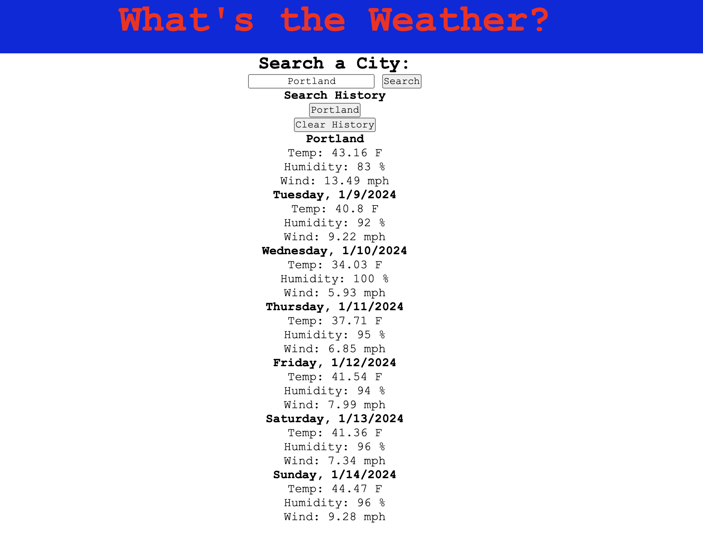

# What's The Temp!

A simple web application that checks the current weather and the 5 day forecast for a specific city. It will show you the current temperatures, humidity and wind speed for the entered city. It will also display the forecast which includes the temp, humidity and wind. This web application will then keep track of your previously searched cities, which you can also clear. 

Link to Application: 

## Screenshots

Here is what the application looks like when first opened. 

Here is what the application looks like when you search a city.

## Technology Used

- HTML
- CSS
- Javascript
- OpenWeatherMap API

## Usage

- Enter the city name in the search bar
- Click Search
- The current forecast and the 5-day forecast will appear
- Click Clear History to clear out your previously searched cities.

## Installation

In order to use this application you will want to clone the repository to your local machine. Then you will open the index.html file in your web browswer and you're good to go!

